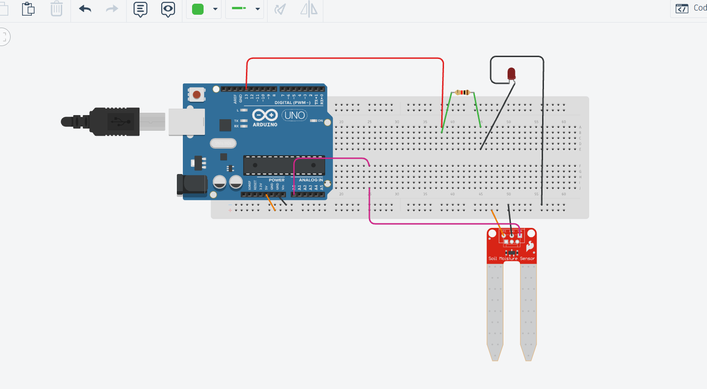
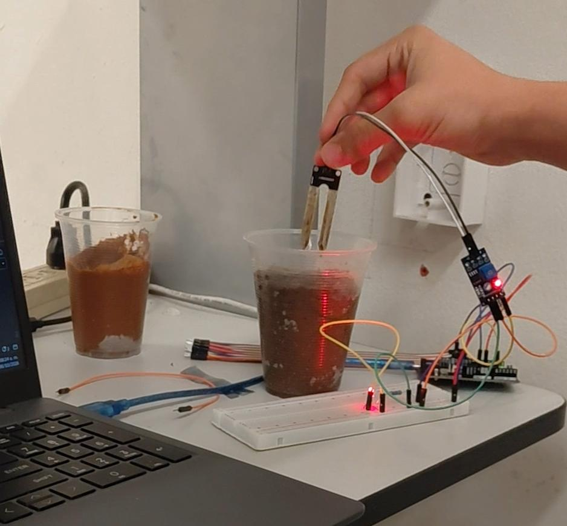
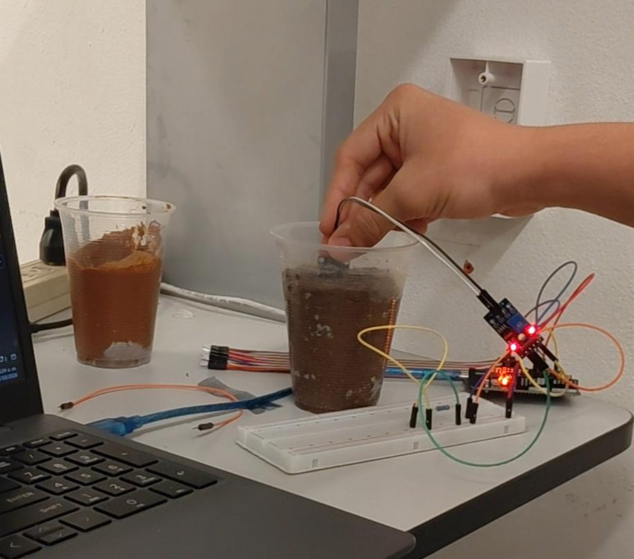
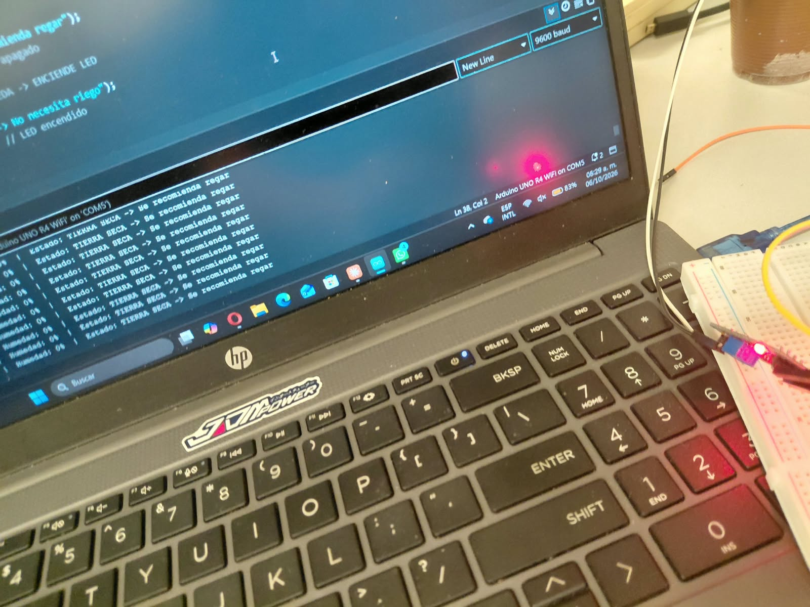
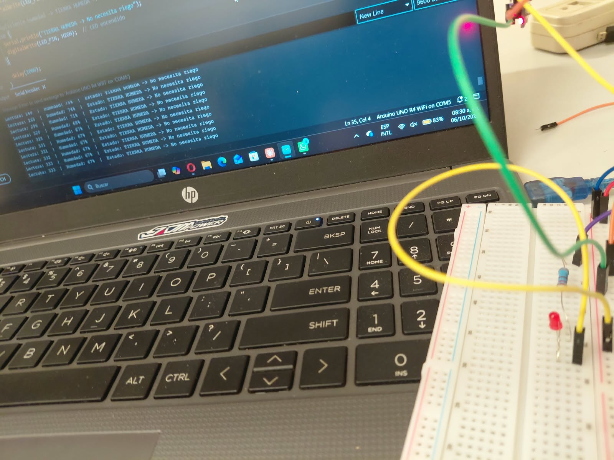

# 2.3 Biosfera (Litosfera): Monitor de humedad del suelo

**Materia:** Desarrollo Sustentable (Unidad 2: Escenario natural)
**Institución:** Tecnológico Nacional de México, campus Mazatlán
**Alumno:** Christian Paul Lizárraga Oronia
**Profesor:** Miguel Ángel Barrón Hernández
**Fecha:** 6 de octubre de 2026

---

## Descripción

Este proyecto mide la humedad del suelo con un sensor resistivo conectado a un Arduino UNO R4 WiFi. El Arduino convierte la lectura analógica en un porcentaje de humedad y muestra en el Monitor Serie si la tierra está **seca** (se recomienda regar) o **húmeda** (no necesita riego). Un LED en el pin 13 sirve como indicador visual del estado del suelo.

La práctica conecta el tema **2.3 Biósfera** con la **litósfera**: el suelo es la capa superficial de la litósfera donde se retiene el agua y los nutrientes que necesitan las plantas. Medir su humedad permite regar solo cuando hace falta y así no desperdiciar agua.

## Objetivos de aprendizaje

- Leer una señal analógica con `analogRead()` y convertirla a porcentaje con `map()` y `constrain()`.
- Tomar decisiones con un umbral (40 %) para clasificar el suelo como seco o húmedo.
- Usar una salida digital (LED) como indicador del estado del suelo.
- Relacionar la humedad del suelo (litósfera) con el uso sustentable del agua (hidrósfera).

## Material utilizado

- Arduino UNO R4 WiFi
- Sensor de humedad de suelo (sondas resistivas + módulo comparador)
- Protoboard
- LED rojo
- Resistencia de 220 Ω
- Cables Dupont
- Cable USB
- Muestras de tierra (seca y húmeda) en vasos

## Conexiones

| Componente | Pin del Arduino |
|---|---|
| Sensor VCC | 5V |
| Sensor GND | GND |
| Sensor SIG (AO) | A0 |
| LED (+) con resistencia de 220 Ω | Pin 13 |
| LED (−) | GND |

## Diagrama del circuito

## Código

[monitor_humedad_suelo.ino](Codigo/monitor_humedad_suelo.ino)

Puntos clave del código:

- **Mapeo invertido:** `map(lectura, 1023, 0, 0, 100)`. El sensor entrega un valor **alto cuando el suelo está seco** (más resistencia) y **bajo cuando está mojado** (el agua conduce mejor), por eso se invierte el rango.
- **Umbral:** `UMBRAL_PORCENTAJE = 40`. Debajo de 40 % la tierra se considera seca.
- **Indicador:** el LED se **enciende** cuando el suelo tiene humedad suficiente y se **apaga** cuando está seco.
- Se toma una lectura por segundo (`delay(1000)`).

## Evidencias de armado

 

## Monitor Serie

| Tierra seca | Tierra húmeda |
|---|---|
|  |  |

## Video del funcionamiento

### ▶️ [Haz clic aquí para ver el video en YouTube](https://www.youtube.com/watch?v=94eOtUH1SWo)

## Resultados

| Condición | Lectura ADC | Humedad | Estado | LED |
|---|---|---|---|---|
| Tierra seca | ≈ 1023 | 0 % | TIERRA SECA → Se recomienda regar | Apagado |
| Tierra húmeda | 265 | 74 % | TIERRA HÚMEDA → No necesita riego | Encendido |
| Tierra húmeda | 296 | 71 % | TIERRA HÚMEDA | Encendido |
| Tierra húmeda | 320 | 68 % | TIERRA HÚMEDA | Encendido |
| Tierra húmeda (estable) | 331 a 333 | 67 % | TIERRA HÚMEDA | Encendido |

Datos completos: [datos_lecturas.csv](Resultados/datos_lecturas.csv)
Documento de resultados: [Resultados.pdf](Resultados/Resultados.pdf)

**Observaciones:**

- En tierra seca la humedad se mantuvo en **0 %** y el LED permaneció apagado.
- Al meter el sensor en tierra mojada la lectura bajó de inmediato y se estabilizó en **≈ 67 %** en unos segundos.
- La lectura sube un poco al inicio (de 265 a 333) porque el agua se reacomoda alrededor de las sondas.
- El sistema respondió en menos de 1 segundo al cambio de condición.

## Preguntas de reflexión

**1. ¿Qué relación tiene esta práctica con la litósfera y la biósfera?**
El suelo es la parte más superficial de la litósfera y es donde viven las raíces de las plantas. Su humedad depende del agua (hidrósfera) y de la atmósfera (lluvia y evaporación). Medirla muestra cómo las tres capas se combinan para sostener la vida en la biósfera.

**2. ¿Por qué se usa un mapeo invertido para calcular el porcentaje?**
Porque el sensor es resistivo. Con tierra seca hay más resistencia entre las sondas y el voltaje que llega a A0 es alto (≈ 1023). Con tierra mojada el agua conduce, la resistencia baja y la lectura también baja. Al invertir el rango, 1023 queda como 0 % y 0 como 100 %.

**3. ¿Cómo ayuda este sistema al desarrollo sustentable?**
Permite regar solo cuando el suelo realmente lo necesita. Así se evita desperdiciar agua, se reduce el lavado de nutrientes del suelo por exceso de riego y se ahorra la energía de bombeo. Es la base de un sistema de riego inteligente.

**4. ¿Qué limitaciones tiene el sensor utilizado?**
Las sondas resistivas se corroen con el tiempo porque circula corriente constante por ellas dentro de la tierra húmeda. También cambian su lectura según el tipo de suelo y la cantidad de sales, por eso se debe calibrar con la tierra real.

**5. ¿Qué mejoras se le podrían hacer?**
- Usar un sensor capacitivo, que no se corroe.
- Alimentar el sensor solo al momento de leer para alargar su vida útil.
- Aprovechar el WiFi del UNO R4 para mandar alertas a Telegram o guardar los datos en la nube.
- Agregar una bomba de agua con un relevador para regar automáticamente.

## Conclusiones

La práctica permitió comprender cómo un sensor analógico traduce una propiedad física del suelo (su humedad) en un valor que el Arduino puede procesar. Con `map()` y `constrain()` se obtuvo un porcentaje fácil de interpretar, y con un umbral simple se clasificó el suelo como seco o húmedo. El sistema distinguió claramente ambas condiciones (0 % contra ≈ 67 %), y muestra que la tecnología puede apoyar el cuidado de la litósfera y el uso responsable del agua.
